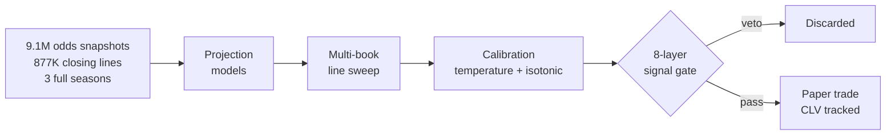

**Data Science major, Statistics minor -- Rutgers University, New Brunswick.**

I build systems where models meet infrastructure. Python for the modeling, Rust for the hot path,
local LLMs for the reasoning layer. Most of what is below runs on my own hardware with no paid API in
the loop.

[ron2k1.github.io](https://ron2k1.github.io) · [LinkedIn](https://www.linkedin.com/in/ronil-basu)

**Jump to** &nbsp;[Selected work](#selected-work) &nbsp;·&nbsp; [Hackathons](#hackathons) &nbsp;·&nbsp; [Open source](#open-source) &nbsp;·&nbsp; [In private](#building-in-private) &nbsp;·&nbsp; [Stack](#stack)

---

## Selected work

> [!TIP]
> Each project leads with the pitch. Click **Implementation** to expand the internals.

### [claude-code-structured-concurrency](https://github.com/ron2k1/claude-code-structured-concurrency)

Cross-platform reaper for orphan Claude Code process trees. Kernel-enforced cleanup on wrapper exit
rather than a best-effort kill loop. 78 tests across PowerShell and bash, CI matrix on all three
platforms.

<b>Implementation</b> &nbsp;--&nbsp; platform guarantees and how each is enforced

 

| Platform | Mechanism | Guarantee |
| --- | --- | --- |
| Windows | Win32 Job Object with `JOB_OBJECT_LIMIT_KILL_ON_JOB_CLOSE` | **STRONG** -- 3-9 ms reap latency |
| Linux 5.14+ | `systemd-run --user --scope` with `cgroup.kill` | **STRONG** |
| Linux fallback | `setpgid` + bash trap | no-systemd hosts and WSL1 |
| macOS | `setpgid` + disowned out-of-process watchdog | **MEDIUM** -- no Job Object, no `cgroup.kill` |

The macOS ceiling is documented rather than papered over, and pinned by a negative test that proves
the failure mode instead of hiding it.

Three shapes: diagnose orphans, reap with a config-driven predicate, or wrap Claude Code in a
kernel-enforced job.

`PowerShell` `bash` `Win32` `cgroups` `systemd`

### [marginalia](https://github.com/ron2k1/marginalia)

Local-first PDF-to-notes app where every note is pinned to the sentence it came from. Click a note
card and the PDF scrolls to the matched passage and flashes it. No API key, nothing leaves the
machine.

<b>Implementation</b> &nbsp;--&nbsp; how anchors resolve, and why they survive a resize

 

Reads a PDF section by section and streams structured notes over SSE from a local Ollama model.

| Stage | Behaviour |
| --- | --- |
| Anchor resolution | Exact text match, then fuzzy when the wording drifts, then page-only |
| Honesty | The anchor chip tells you which of the three actually resolved |
| Coordinates | Normalized to the page, so anchors survive zoom and resize |
| Generation | Local Ollama (`qwen2.5:7b`) over SSE, detail dial from Concise to Thorough |
| Testing | Hermetic Playwright e2e that boots its own MockDriver backend on scratch ports |

Built for paper: notes export to wide-margin or Cornell print layouts for copying out longhand.

`FastAPI` `SQLModel` `PyMuPDF` `React` `TypeScript` `pdf.js` `Ollama`

### Courtside &nbsp;--&nbsp; NBA player-prop forecasting engine

In paper trading and approaching go-live. Public methodology and validated walk-forward results live
in **[courtside-showcase](https://github.com/ron2k1/courtside-showcase)**.

> [!NOTE]
> Engine source is private. The showcase repo carries the methodology and the validated results.

<b>Implementation</b> &nbsp;--&nbsp; calibration, the eight vetoes, and the Rust hot path

 

**Calibration** is temperature scaling followed by isotonic regression, fit per stat and per side,
under walk-forward isolation so no future information reaches a fitted bin.

**The signal gate** is eight independent vetoes, any one of which discards the play: edge floor, CLV
gate, stat whitelist, bin blocking, confidence floor, sample gate, hit-rate check, and a real-line
requirement.

**`FastRust`** is a companion Rust compute engine over PyO3 that takes the hot-path EV math with
GIL-releasing batch parallelism. It is a drop-in replacement for the Python `compute_ev()`, so the
pure-Python path stays runnable as a correctness oracle.

| Component | Detail |
| --- | --- |
| Data | 877K closing lines, 9.1M NBA snapshots, 3 full seasons |
| Calibration | Temperature scaling + isotonic regression, per stat and per side |
| Rust layer | PyO3 0.22, rayon batch API |
| Validation | Walk-forward backtesting, CLV-tracked paper trading |

`Python` `Rust` `PyO3` `XGBoost` `isotonic regression` `walk-forward backtesting`

### [ClawWorld](https://github.com/ron2k1/ClawWorld)

Tile-based RPG where every NPC is a live AI agent. Rendering engine written from scratch, no Phaser
and no Pixi. World state is shaped by inter-agent negotiation rather than scripted dialogue trees.

<b>Implementation</b> &nbsp;--&nbsp; the renderer, and how NPCs consult each other mid-stream

 

| Layer | Detail |
| --- | --- |
| Rendering | From-scratch canvas engine, `A*` pathfinding, sprite atlas, map transitions |
| Animation | 4-directional sprite animation |
| Delegation | NPCs consult each other mid-stream via `ask_agent()` tool calls |
| Providers | 10 NPCs, each routed to Anthropic, xAI, Ollama, or a local subprocess |
| Transport | Ed25519-authed WebSocket gateway |

Because delegation happens mid-conversation rather than as a preprocessing step, an NPC can change
its answer partway through based on what another agent tells it.

`TypeScript` `Canvas` `WebSocket` `Ed25519`

---

## Hackathons

### [Intuit TechWeek SMB Underwriting](https://github.com/ron2k1/intuit-techweek-smb-underwriting)

**2nd place &nbsp;--&nbsp; Intuit HQ, NY Tech Week 2026**

Explainable-ML underwriting challenge. We turned calibrated PD models (validation AUROC 0.740) into
expected-NPV approval decisions for 13,306 applicants, forecast how the funded book defaults over 13
weeks, and answered 900 causal what-if queries with per-feature guardrails. The dataset was
booby-trapped with selection bias and label leakage on purpose, and finding those traps was most of
the scoring. I owned the shared feature pipeline and the approval-policy deliverable.

`scikit-learn` `probability calibration` `causal inference` `survival analysis`

### [StormLink](https://github.com/Purabhh/stormlink)

**Best Use of ElevenLabs &nbsp;--&nbsp; HackUSF 2026**

Multi-agent disaster response dashboard. We routed live NOAA and FEMA feeds through Google ADK agents
over the A2A protocol, with ElevenLabs voice alerts surfacing material weather events in real time. I
wrote the AgentPanel component that visualizes the routing pipeline with animated data packets and
elapsed timers.

`Google ADK` `A2A protocol` `Gemini 2.5 Flash` `ElevenLabs` `Next.js` `FastAPI` `Leaflet`

---

## Open source

### [spotify-cleaner](https://github.com/ron2k1/spotify-cleaner)

CLI and local web UI that finds and removes your least-listened Spotify tracks. Scoring reads your
GDPR data export rather than the Web API, because the API does not expose real per-track play counts.
Dry run is the default, and applying a cut requires typing DELETE.

`Python` `spotipy` `FastAPI` `React` &nbsp;·&nbsp; MIT

### [Cluely](https://github.com/ron2k1/Ronils-Cluely-OPENSOURCE)

Capture-invisible AI meeting overlay for Windows. Live transcription through faster-whisper, answers
from the local Claude CLI, and the window is excluded from screen capture, so it does not appear in a
shared screen or a recording.

`Python` `PySide6` `faster-whisper` `Win32` &nbsp;·&nbsp; Apache-2.0

### [Crash](https://github.com/ron2k1/crash-app)

Desktop agent marketplace where humans and AI agents buy, sell, and bid in one live shared room.
Agents pay for their own tool calls over a real x402 USDC micropayment rail.

`Tauri 2` `React 19` `react-three-fiber` `Rust` `x402` &nbsp;·&nbsp; MIT

---

## Building in private

<b>InternPilot</b> &nbsp;--&nbsp; automated job application pipeline

 

Scrapes 13 job sources, scores postings against a resume profile, auto-fills ATS forms via Playwright
across Greenhouse, Workday, Lever, Ashby, iCIMS, and SmartRecruiters, and drafts cover letters
through a local LLM. Currently tracking 127 target firms.

`Python` `Playwright` `Ollama` `FastAPI` `APScheduler`

<b>nemotron-reasoning-challenge</b> &nbsp;--&nbsp; autonomous fine-tuning pipeline

 

Daemon that loops through 10 stages: Claude-powered math CoT generation, QLoRA SFT via Axolotl, GRPO
reinforcement learning, vLLM eval, failure diagnosis, and Kaggle submission. Deadline-aware strategy
that shifted from exploration to exploitation as the June 2026 deadline approached.

`PyTorch` `Axolotl` `trl GRPOTrainer` `vLLM` `Claude API`

---

## Stack

| Layer | Tools |
| --- | --- |
| **Languages** | Python, Rust, TypeScript, R, SQL, Bash, LaTeX |
| **ML / quant** | XGBoost, LightGBM, scikit-learn, NumPy, SciPy, pandas, isotonic and temperature calibration |
| **Web** | React, Next.js, FastAPI, Flask, Vite, Alpine.js |
| **Infra / AI** | PyO3, PostgreSQL, SQLite, Playwright, Ollama, Claude API, Google ADK, Railway |
