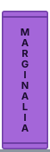
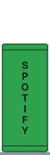

I study data science and statistics at Rutgers, class of 2027.

 
<picture><source media="(prefers-color-scheme: dark)" srcset="https://raw.githubusercontent.com/ron2k1/ron2k1/output/github-snake-dark.svg"><source media="(prefers-color-scheme: light)" srcset="https://raw.githubusercontent.com/ron2k1/ron2k1/output/github-snake.svg"></picture>

[marginalia](https://github.com/ron2k1/marginalia) · Turns a PDF into notes pinned to the exact sentence they came from, offline on a local model 
[claude-code-structured-concurrency](https://github.com/ron2k1/claude-code-structured-concurrency) · Makes sure a dead Claude Code session never leaves forty node processes behind 
[crash-app](https://github.com/ron2k1/crash-app) · A marketplace where AI agents bid next to humans and pay for their own tool calls 
[Cluely](https://github.com/ron2k1/Ronils-Cluely-OPENSOURCE) · A Windows meeting overlay that answers from a local Claude CLI, invisible to screen share 
[spotify-cleaner](https://github.com/ron2k1/spotify-cleaner) · Finds the songs you never play and clears them out, but only after you type DELETE 
[courtside-showcase](https://github.com/ron2k1/courtside-showcase) · Walk-forward results for my NBA player prop engine, which stays private

We took 2nd at Intuit's NY Tech Week 2026 hackathon with [an AI that decides which small-business loans are safe to fund](https://github.com/ron2k1/intuit-techweek-smb-underwriting). I owned the feature pipeline and the approval policy. At HackUSF 2026 we won Best Use of ElevenLabs with StormLink, which routes live storm data to people in the path.
