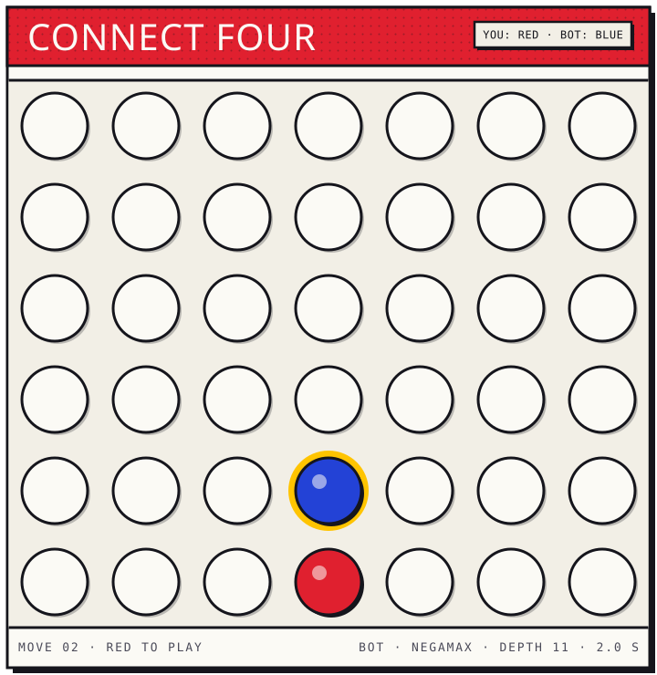

Data science and statistics at Rutgers, class of 2027. I build things that run on my own hardware,
mostly local models and tools I actually use.

[ron2k1.github.io](https://ron2k1.github.io) · [LinkedIn](https://www.linkedin.com/in/ronil-basu)

## Play me

<!-- c4:start -->
Red is you. Tap a column to drop.

Red to play · Last move by @ron2k1 · Humans 0, bot 0, draws 0 · Most moves: @ron2k1 (1)

<!-- c4:end -->

Tap a column and press Submit on the issue it opens. Give it a minute, then refresh. I cap the bot
at two seconds a move. The engine is in [connect4/](connect4/).

## Hot off the press

### [claude-code-structured-concurrency](https://github.com/ron2k1/claude-code-structured-concurrency)

Kills orphan Claude Code process trees at the kernel level on Windows and Linux, with a watchdog
on macOS, so a dead session never leaves forty node processes behind.

`PowerShell` `bash` `Win32 Job Objects` `cgroups`

### [marginalia](https://github.com/ron2k1/marginalia)

Turns a PDF into notes pinned to the exact sentence they came from. Click a note and the page
scrolls to it. Runs fully offline on a local model.

`FastAPI` `React` `PyMuPDF` `Ollama`

### Courtside

NBA player-prop forecasting engine, in paper trading. Methodology and walk-forward results are in
[courtside-showcase](https://github.com/ron2k1/courtside-showcase). The engine is private.

`Python` `XGBoost` `probability calibration`

## Hackathons

### [Intuit TechWeek SMB Underwriting](https://github.com/ron2k1/intuit-techweek-smb-underwriting)

**2nd place · Intuit HQ, NY Tech Week 2026**

An AI that decides which small-business loans are safe to fund, on a loan book seeded with
selection bias and label leakage. I owned the feature pipeline and the approval policy.

`scikit-learn` `probability calibration` `causal inference` `survival analysis`

### StormLink

**Best Use of ElevenLabs · HackUSF 2026**

We routed live storm data through Google ADK agents into voice alerts for people in the path. I
built the panel that shows the agents working.

`Google ADK` `ElevenLabs` `Next.js` `FastAPI` `Leaflet`

## Open source

### [spotify-cleaner](https://github.com/ron2k1/spotify-cleaner)

Finds the songs you never play and clears them out of your Spotify library. Dry run by default,
and deleting anything means typing DELETE first.

`Python` `spotipy` `FastAPI` `React` · MIT

### [Cluely](https://github.com/ron2k1/Ronils-Cluely-OPENSOURCE)

A meeting overlay for Windows that transcribes live and answers from a local Claude CLI, invisible
to screen share.

`Python` `PySide6` `faster-whisper` `Win32` · Apache-2.0

### [Crash](https://github.com/ron2k1/crash-app)

A desktop marketplace where humans and AI agents buy, sell, and bid in one live room. Agents pay
for their own tool calls over a real x402 USDC rail.

`Tauri 2` `React 19` `react-three-fiber` `Rust` `x402` · MIT

## The toolbelt

SIE certified, FINRA, Sep 2025.

## Building in private

### InternPilot

Scrapes 13 job sources, scores postings against my resume, fills ATS forms with Playwright, and
drafts cover letters on a local LLM.

### nemotron-reasoning-challenge

A daemon that generates math reasoning data, fine-tunes with QLoRA and GRPO, evaluates on vLLM,
and submits to Kaggle on its own.

## Say hi

[LinkedIn](https://www.linkedin.com/in/ronil-basu) is fastest. The longer story is at
[ron2k1.github.io](https://ron2k1.github.io).
